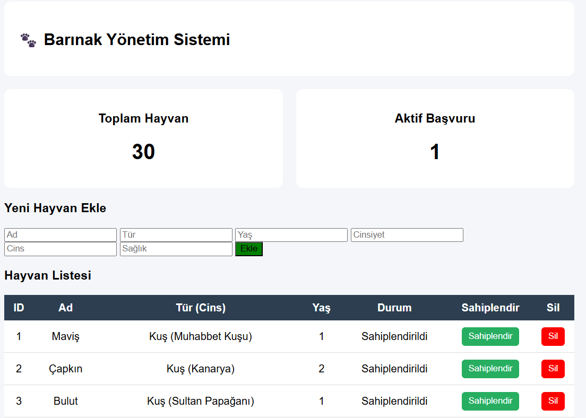

# 🐾 Animal Shelter Management System

This project is a web-based application developed to manage animal shelter operations efficiently.

## Features
- List all animals in the shelter
- Add new animals
- Update animal information
- Adoption system
- Prevent deletion of adopted animals (business rule with database trigger)

## Technologies
- Java (Spring Boot)
- PostgreSQL
- JDBC
- Thymeleaf (HTML/CSS)

## Database Design
- Relational database with multiple entities (Animal, Owner, Application, etc.)
- Foreign key constraints
- Triggers to enforce business rules

## Screenshots


## 📁 Project Structure

```
Barinak-Yonetim-Sistemi/
 ├── src/
 ├── templates/
 ├── database/
 │    └── schema.sql
 ├── screenshots/
 ├── README.md
```

## Database
The database schema is included in the `database/barinak.sql` file.

To set up the database:
1. Create a PostgreSQL database
2. Run the SQL script

## 📌 Notes
- Adopted animals cannot be deleted due to database constraints and triggers.
